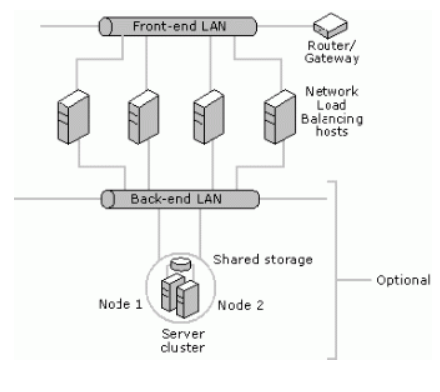

# ASIR2-IAW-Practica04
## Creación de una segunda máquina virtual para Apache

Es esta práctica deberémos automátizar la instalación y configuración de una aplicación web *LAMP* en **tres máquinas virtuales EC2** de *Amazon Web Services(AWS)*, con la última versión de Ubuntu Server.

El objetivo es crear una arquitectura de alta disponibilidad que sea escalable y redundante, de modo que podamos balanear la carga entre todos los frontales web.

**Arquitectura**
- Una capa de *front-end* , formada por dos servidores Web con Apache HTTP Server
- Una capa de *back-end* , formada por un servidor *MySQL*

Crearemos tres máquinas virtuales
- Frontal Web 1
- Frontal Web 2
- Servidor de Base de Datos MySQL

### Arquitectura de red ideal

**Código Front**
~~~
#!/bin/bash

# Marcamos los pasos
set -x
# Actualizamos la lista de paquetes
apt update

#Actualizamos los paquetes
apt upgrade -y

###########################
#Comenzamos la instalación#
###########################

# Instalamos apache
apt install apache2 -y

# Instalamos los módulos de PHP
apt install php libapache2-mod-php php-mysql -y

#######################################
# Instalamos herramientas adicionales #
#######################################

# Declaración las variables 
HTTPPASSWD_USER=resti
HTTPPASSWD_PASSWD=root
HTTPPASSWD_DIR=/home/ubuntu
#IP privada del back-end
IP_MYSQL=3.239.216.179

#########
#Adminer#
#########

# Creamos carpeta
mkdir /var/www/html/Adminer
# Nos movemos a esta ruta
cd /var/www/html/Adminer

# Instalamos Adminer
wget https://github.com/vrana/adminer/releases/download/v4.7.7/adminer-4.7.7-mysql.php

# Renombrar el archivo descargado por index
mv adminer-4.7.7-mysql.php index.php

############
#PhpMyAdmin#
############

#Instalamos la utilidad unzip para descomprimir el codigo fuente

apt install unzip -y

#Descargamos el código fuente de phpMyAdmin del repositorio oficial

cd /home/ubuntu

rm -rf phpMyAdmin-5.0.4-all-languages.zip

wget https://files.phpmyadmin.net/phpMyAdmin/5.0.4/phpMyAdmin-5.0.4-all-languages.zip

# Descomprimimos el archivo
unzip phpMyAdmin-5.0.4-all-languages.zip

# Borramos el .zip
rm -rf phpMyAdmin-5.0.4-all-languages.zip

# Movemos el directorio de phpMyadmin
mv phpMyAdmin-5.0.4-all-languages/ /var/www/html/phpmyadmin

#Configuramos el archivo config.inc.php
cd /var/www/html/phpmyadmin

mv config.sample.inc.php config.inc.php

sed -i "s/localhost/$IP_MYSQL/" /var/www/html/phpmyadmin/config.inc.php

##########
#GoAccess#
##########

echo "deb http://deb.goaccess.io/ $(lsb_release -cs) main" | sudo tee -a /etc/apt/sources.list.d/goaccess.list
wget -O - https://deb.goaccess.io/gnugpg.key | sudo apt-key add -
apt-get update -y
apt-get install goaccess -y

# Creación de un direcctorio para consultar GoAccess

mkdir -p /var/www/html/stats
goaccess /var/log/apache2/access.log -o /var/www/html/stats/index.html --log-format=COMBINED --real-time-html &
htpasswd -bc $HTTPPASSWD_DIR/.htpasswd $HTTPPASSWD_USER $HTTPPASSWD_PASSWD

# Copiamos el archivo de configuración de Apache
cp /home/ubuntu/ASIR2-IAW-Practica03/000-default.conf /etc/apache2/sites-available/

# Reiniciamos el servicio
systemctl restart apache2

# ----------------------------#
# Instalamos la aplicación web#
# ----------------------------#

# Clonamos el repositorio
cd /var/www/html
rm -rf iaw-practica-lamp
git clone https://github.com/josejuansanchez/iaw-practica-lamp
mv /var/www/html/iaw-practica-lamp/src/* /var/www/html/

# Configuramos la IP del config.php
sed -i "s/localhost/$IP_MYSQL/" /var/www/html/config.php

# Eliminamos contenido que no sea útil
rm -rf /var/www/html/index.html
rm -rf /var/www/html/iaw-practica-lamp

#Cambiamos los permisos
chown www-data:www-data * -R

# Reiniciamos el apache
systemctl restart apache2

# Cambiamos a la ruta original

cd /home/ubuntu
~~~

**Código Back**

~~~
#! /bin/bash
set -x

# Actualizamos la lista de paquetes
apt update

# Instalamos el MySQL Server
apt install mysql-server -y

# Instalamos las librerias PHP para MySQL
apt install debconf-utils -y

# Declaración de variables

IP_PRIVADA_FRONT=3.221.150.99 # Indica la interfaz de red del servidor de MySQL que permite conexiones
BD_ROOT_PASSWD=root 

# Actualizamos la contraseña de root de MySQL
mysql -u root <<< "ALTER USER 'root'@'localhost' IDENTIFIED WITH caching_sha2_password BY '$BD_ROOT_PASSWD'; "

# le damos permisos
mysql -u root  <<< " FLUSH PRIVILEGES ; "

#############################################################
# Ejecutamos el script de base de datos de la aplicación web#
#############################################################

# Clonamos el repositorio
cd /home/ubuntu
rm -rf iaw-practica-lamp
git clone https://github.com/josejuansanchez/iaw-practica-lamp
mv /var/www/html/iaw-practica-lamp/src/* /var/www/html/

# Eliminamos contenido que no sea útil
rm -rf /var/www/html/index.html
rm -rf /var/www/html/iaw-practica-lamp

# Importamos el script de creación de la base de datos
mysql -u root -p$BD_ROOT_PASSWD < /home/ubuntu/iaw-practica-lamp/db/database.sql

#---------------------------------------------------------------#
#Configuramos MySQL para permitir conexiones desde la IP privada
#---------------------------------------------------------------#
sudo sed -i "s/127.0.0.1/$IP_PRIVADA_FRONT/" /etc/mysql/mysql.conf.d/mysqld.cnf

#Reiniciamos servicio MySQL
systemctl restart mysql

#---------------------------------------------------------------#

~~~

**Archivo de configuración 000-default**
~~~
<VirtualHost *:80>
        #ServerName www.example.com
        ServerAdmin webmaster@localhost
        DocumentRoot /var/www/html

  <Directory "/var/www/html/stats">
          AuthType Basic
          AuthName "Acceso restringido"
          AuthBasicProvider file
          AuthUserFile "/home/ubuntu/.htpasswd"
          Require valid-user
  </Directory>

        ErrorLog ${APACHE_LOG_DIR}/error.log
        CustomLog ${APACHE_LOG_DIR}/access.log combined
</VirtualHost>
~~~
